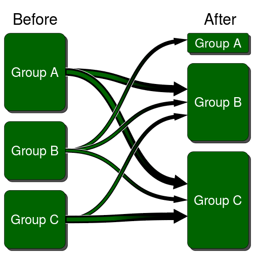
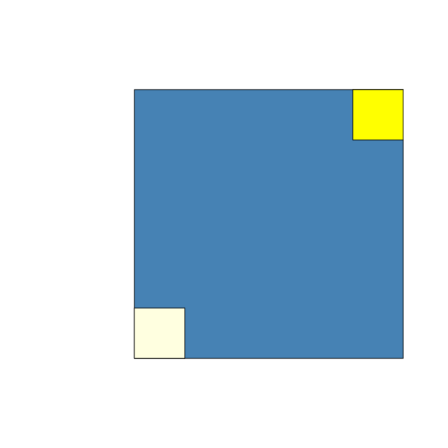
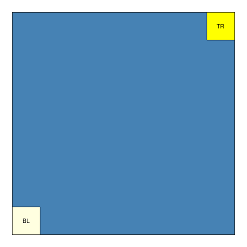
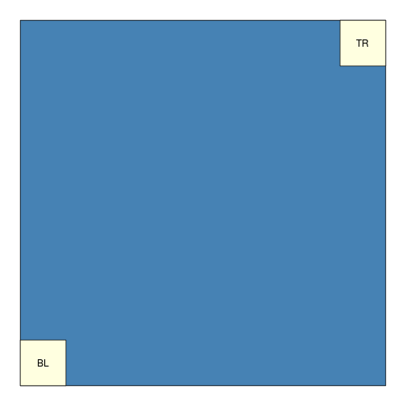
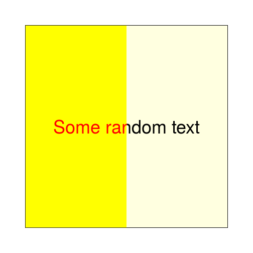

SRGUG meetup - the grid pacakge

The awesome grid package
========================================================
author: Max Gordon
date: 2016-09-28
autosize: true
<style>
.small-code pre code {
  font-size: 1em;
}
</style>

What is the `grid` pacakge?
========================================================


Author: Paul Murrell
Part of the 14 base pacakges.

> Grid graphics provides an alternative to the standard R graphics. The user is able to define arbitrary rectangular regions (called viewports) on the graphics device and define a number of coordinate systems for each region. Drawing can be specified to occur in any viewport using any of the available coordinate systems.

***


What makes `grid` great?
========================================================

&nbsp;

- Perfect control over the over ouptut
- Your imagination sets the limit
- Code professional infographics

***



Basics
========================================================
class: small-code

Everything is arranged around viewports. A viewport has:

- x/y position
- width/height
- encapsulation


```r
library(grid)
grid.newpage()
pushViewport(viewport(x=.6, y=.5, width=.6, height=.6))
grid.rect(gp = gpar(fill="steelblue"))
grid.rect(width=unit(2, "cm"), height=unit(2, "cm"), 
          x=0, y=0, just=c(0,0),
          gp = gpar(fill="lightyellow"))
grid.rect(width=unit(2, "cm"), height=unit(2, "cm"), 
          x=1, y=1, just=c(1,1),
          gp = gpar(fill="yellow"))
upViewport()
```

*** 




Viewports 4 subelements - why?
========================================================
class: small-code

Adding text to boxes without viewports:


```r
library(grid)
grid.newpage()
pushViewport(viewport(x=.5, y=.5, width=.9, height=.9))
grid.rect(gp = gpar(fill="steelblue"))
grid.rect(width=unit(2, "cm"), height=unit(2, "cm"), 
          x=0, y=0, just=c(0,0),
          gp = gpar(fill="lightyellow"))
grid.text("BL", 
          x=unit(1, "cm"), 
          y=unit(1, "cm"))
grid.rect(width=unit(2, "cm"), height=unit(2, "cm"), 
          x=1, y=1, just=c(1,1),
          gp = gpar(fill="yellow"))
grid.text("TR", 
          x=unit(1, "npc") - unit(1, "cm"), 
          y=unit(1, "npc") - unit(1, "cm"))
upViewport()
```

***



### What about:

* Resizing?
* Component isolation?

Viewports 4 subelements - how?
========================================================

Adding text to boxes with viewports:


```r
library(grid)
grid.newpage()
pushViewport(viewport(x=.5, y=.5, width=.9, height=.9))
grid.rect(gp = gpar(fill="steelblue"))

pushViewport(
  viewport(x=0, y=0, 
           width=unit(2, "cm"), height=unit(2, "cm"),
           just=c(0,0)))
grid.rect(gp = gpar(fill="lightyellow"))
grid.text("BL")
upViewport()

pushViewport(
  viewport(x=1, y=1, 
           width=unit(2, "cm"), height=unit(2, "cm"),
           just=c(1,1)))
grid.rect(gp = gpar(fill="yellow"))
grid.text("TR")
upViewport()
upViewport()
```

***


Viewports allow encapsulating
========================================================
class: small-code


```r
box <- function(box_label,
                x, y, height, width,
                just) {
  pushViewport(
    viewport(x=x, y=y, 
             width=width, height,
             just=just))
  
  grid.rect(gp = gpar(fill="lightyellow"))
  grid.text(box_label)
  upViewport()
}

library(grid)
grid.newpage()
pushViewport(viewport(x=.5, y=.5, width=.9, height=.9))
grid.rect(gp = gpar(fill="steelblue"))

box("BL",
    x=0, y=0, 
    width=unit(2, "cm"), height=unit(2, "cm"),
    just=c(0,0))
box("TR",
    x=1, y=1, 
    width=unit(2, "cm"), height=unit(2, "cm"),
    just=c(1,1))

upViewport()
```

***




Encapsulating side benefits
========================================================
class: small-code


```r
boxFancy <- function(box_label,
                x, y, height, width,
                just) {
  pushViewport(
    viewport(x=x, y=y, 
             width=width, height,
             just=just))
  
  grid.rect(gp = gpar(fill="lightyellow"))
  grid.text(box_label,
             gp=gpar(cex=5))
  upViewport()
}

library(grid)
grid.newpage()
box("Some random text",
    x=0.5, y=0.5, 
    width=unit(.8, "npc"), height=unit(.8, "npc"),
    just=c(0.5,0.5))
```

***


