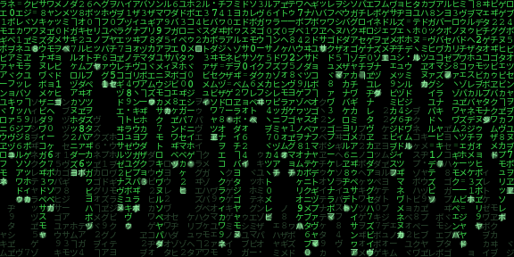

The grid package
========================================================
autosize: true

<style>
.small-code pre code {
  font-size: 1em;
}
.tiny-code pre code {
  font-size: .7em;
}
.reveal blockquote {
  font-size: .8em;
}
.small-text p,  .small-text ul {
  font-size: .8em;
  margin-bottom: 10px;
}

.small-text li {
  margin-top: 0px;
  margin-bottom: 0px;
}

.small-text pre code {
  font-size: 1em;
}

.footer {
    color: black;
    background: #E8E8E8;
    position: fixed;
    top: 90%;
    text-align:center;
    width:100%;
}
.midcenter {
    position: fixed;
    top: 50%;
    left: 50%;
}

</style>




What is the `grid` package?
========================================================

Author: Paul Murrell
Part of the 14 base packages.

> Grid graphics provides an alternative to the standard R graphics. The user is able to define arbitrary rectangular regions (called viewports) on the graphics device and define a number of coordinate systems for each region. Drawing can be specified to occur in any viewport using any of the available coordinate systems.

***


What makes `grid` great?
========================================================

&nbsp;

- Perfect control over the over output
- Your imagination sets the limit
- Code professional info-graphics

***


Basics
========================================================
class: small-text

Everything is arranged around viewports. A viewport has:

- x/y position
- width/height
- encapsulation


```r
library(grid)
grid.newpage()
pushViewport(viewport(x=.6, y=.5, width=.6, height=.6))
grid.rect(gp = gpar(fill="steelblue"))
grid.rect(width=unit(2, "cm"), height=unit(2, "cm"), 
          x=0, y=0, just=c(0,0),
          gp = gpar(fill="lightyellow"))
grid.rect(width=unit(2, "cm"), height=unit(2, "cm"), 
          x=1, y=1, just=c(1,1),
          gp = gpar(fill="yellow"))
upViewport()
```

*** 


Viewports 4 sub-elements - why?
========================================================
class: small-text

Adding text to boxes without viewports:


```r
grid.newpage()
pushViewport(viewport(x=.5, y=.5, width=.9, height=.9))
grid.rect(gp = gpar(fill="steelblue"))
grid.rect(width=unit(2, "cm"), height=unit(2, "cm"), 
          x=0, y=0, just=c(0,0),
          gp = gpar(fill="lightyellow"))
grid.text("BL", 
          x=unit(1, "cm"), 
          y=unit(1, "cm"))
grid.rect(width=unit(2, "cm"), height=unit(2, "cm"), 
          x=1, y=1, just=c(1,1),
          gp = gpar(fill="yellow"))
grid.text("TR", 
          x=unit(1, "npc") - unit(1, "cm"), 
          y=unit(1, "npc") - unit(1, "cm"))
upViewport()
```

***


### What about:

* Re-sizing?
* Component isolation?

Viewports 4 sub-elements - how?
========================================================
class: small-text

Adding text to boxes with viewports:


```r
grid.newpage()
pushViewport(viewport(x=.5, y=.5, width=.9, height=.9))
grid.rect(gp = gpar(fill="steelblue"))

pushViewport(
  viewport(x=0, y=0, 
           width=unit(2, "cm"), height=unit(2, "cm"),
           just=c(0,0)))
grid.rect(gp = gpar(fill="lightyellow"))
grid.text("BL")
upViewport()

pushViewport(
  viewport(x=1, y=1, 
           width=unit(2, "cm"), height=unit(2, "cm"),
           just=c(1,1)))
grid.rect(gp = gpar(fill="yellow"))
grid.text("TR")
upViewport()
upViewport()
```

***


Viewports allow encapsulating
========================================================
class: tiny-code


```r
box <- function(box_label,
                x, y, height, width,
                just) {
  pushViewport(
    viewport(x=x, y=y, 
             width=width, height,
             just=just))
  
  grid.rect(gp = gpar(fill="lightyellow"))
  grid.text(box_label)
  upViewport()
}

library(grid)
grid.newpage()
pushViewport(viewport(x=.5, y=.5, width=.9, height=.9))
grid.rect(gp = gpar(fill="steelblue"))

box("BL",
    x=0, y=0, 
    width=unit(2, "cm"), height=unit(2, "cm"),
    just=c(0,0))
box("TR",
    x=1, y=1, 
    width=unit(2, "cm"), height=unit(2, "cm"),
    just=c(1,1))

upViewport()
```

***


Encapsulating side benefits
========================================================
class: tiny-code


```r
boxFancy <- function(box_label,
                     x, y, height, width,
                     just) {
  pushViewport(
    viewport(x=x, y=y, 
             width=width, height,
             just=just))
  
  grid.rect(gp = gpar(fill="lightyellow"))
  grid.text(box_label,
            gp=gpar(cex=3))
  width = convertUnit(unit(1, "npc"), "cm")
  pushViewport(viewport(x = 0, y=0, just=c(0,0), 
                        width=.5, clip="on"))
  grid.rect(gp=gpar(fill="yellow", col=NA))
  grid.text(box_label, 
            gp=gpar(cex=3, col="red"),
            vp=viewport(width = width, x=0,y=0, 
                        just=c(0,0)))
  upViewport()
  grid.rect(gp = gpar(fill=NA))
  upViewport()
}

library(grid)
grid.newpage()
boxFancy("Some random text",
         x=0.5, y=0.5, 
         width=unit(.8, "npc"), height=unit(.8, "npc"),
         just=c(0.5,0.5))
```

***


Core parts 4 a flowchart
========================================================
class: small-code


```r
library(Gmisc)
grid.newpage()
pushViewport(vp = viewport(gp = gpar(cex = 2)))
box <- list(
  boxGrob("This box autosizes to the\ntext within", 
          y=unit(.95, "npc"), bjust="top"),
  boxPropGrob("This box can show a porportion", 
              label_left = "Left",
              label_right = "Right",
              prop=.3,
              y=unit(0.05, "npc"), bjust="bottom"))
lapply(box, grid.draw)
```

***


Core parts 4 a flowchart - positions
========================================================
class: small-code


```r
grid.newpage()
pushViewport(vp = viewport(gp = gpar(cex = 2)))
lapply(box, grid.draw)
draw_coords <- function(box)
  with(attr(box, "coords"), {
    grd_circ <- function(x,y,fill)
      grid.circle(x=x, y=y, gp=gpar(fill=fill),
                  r=unit(2, "mm"))
    grd_circ(x=x, y=y, "black")
    grd_circ(x=x, y=top, "yellow")
    grd_circ(x=x, y=bottom, "yellow")
    grd_circ(x=left, y=y, "orange")
    grd_circ(x=right, y=y, "orange")
    if ("left_x" %in% ls()) {
      grd_circ(x=left_x, y=top, "blue")
      grd_circ(x=left_x, y=bottom, "blue")
      grd_circ(x=right_x, y=top, "purple")
      grd_circ(x=right_x, y=bottom, "purple")
    }
  })
lapply(box, draw_coords)
```

***


flowchart - connect
========================================================
class: small-code


```r
grid.newpage()
pushViewport(
  vp=viewport(gp=gpar(cex=2)))

lapply(box, grid.draw)
lapply(box, draw_coords)

connectGrob(start=box[[1]], 
            end=box[[2]],
            type="v")
```

***


flowchart - connect to prop
========================================================
class: small-code


```r
grid.newpage()
pushViewport(
  vp=viewport(gp=gpar(cex=2)))

lapply(box, grid.draw)
lapply(box, draw_coords)

connectGrob(start=box[[1]], 
            end=box[[2]],
            type="v", 
            subelmnt="left")

connectGrob(start=box[[1]], 
            end=box[[2]],
            type="v", 
            subelmnt="right")
```

***


Finally a flowchart
========================================================
class: tiny-code


```r
grid.newpage()
distance <- unit(.2, "npc")
boxs <- list()
boxs$start_pop <- boxGrob("Start pop.\nn = 145 patients", y=1, bjust="top")
boxs$included <- 
  boxGrob("Included n = 78 patients", bjust="top",
          y=attr(boxs$start_pop, "coords")$bottom - distance)
boxs$excluded <- 
  boxGrob("Excluded:\n - 40 CHF\n - 7 prev. hist.\n - 20 misc.", 
          y=attr(boxs$start_pop, "coords")$bottom - unit(.1, "npc"),
          x=1, bjust="right", just="left")
boxs$groups <- 
  boxPropGrob("Randomized", 
              label_left=sprintf("Treatment\n %d patients",
                                   round(78*.3)),
              label_right=sprintf("Control\n %d patients",
                                    78 - round(78*.3)),
              prop=.3, bjust="top",
              y=attr(boxs$included, "coords")$bottom - distance)
boxs$fup_trtmnt <- 
  with(attr(boxs$groups, "coords"),
       boxGrob("Treatment 1 year: \n - 1 patients died",
               x=left_x,
               bjust="bottom", y=0))
boxs$fup_control <- 
  with(attr(boxs$groups, "coords"),
       boxGrob("Controls 1 year: \n - 2 patients died",
               x=right_x,
               bjust="bottom", y=0))
lapply(boxs, grid.draw)
```

***


Finally a flowchart - connecting the dots
========================================================
class: small-code


```r
grid.newpage() 
lapply(boxs, grid.draw)
connectGrob(start=boxs$start_pop, end=boxs$included, 
            type="v")
connectGrob(start=boxs$start_pop, end=boxs$excluded, 
            type="L")
connectGrob(start=boxs$included, end=boxs$groups, 
            type="v")
connectGrob(start=boxs$groups, end=boxs$fup_trtmnt, 
            type="v", subelmnt="left")
connectGrob(start=boxs$groups, end=boxs$fup_control, 
            type="v", subelmnt="right")
```

***


Smoothness is fiction part 1
===================================================
class: small-code


```r
grid.newpage()
no_points <- c(100)
clrs <- colorRampPalette(c("darkred", "darkblue"))(length(no_points))
for (i in length(no_points):1) {
  l <- 
    data.frame(x = c(.1, -.1, .6, 1),
               y = c(.9, -.5, 0, 1)) %>% 
    gnrlBezierPoints(length_out = no_points[i])
  grid.lines(l[,1], l[,2], 
             gp=gpar(col=clrs[i], lwd = 4))
}
```

***


Smoothness is fiction part 2
===================================================
class: small-code


```r
grid.newpage()
no_points <- c(100, 10)
clrs <- colorRampPalette(c("darkred", "darkblue"))(length(no_points))
for (i in length(no_points):1) {
  l <- 
    data.frame(x = c(.1, -.1, .6, 1),
               y = c(.9, -.5, 0, 1)) %>% 
    gnrlBezierPoints(length_out = no_points[i])
  grid.lines(l[,1], l[,2], 
             gp=gpar(col=clrs[i], lwd = 4))
}
```

***


Smoothness is fiction part 3
===================================================
class: small-code


```r
grid.newpage()
no_points <- c(100, 10, 5)
clrs <- colorRampPalette(c("darkred", "darkblue"))(length(no_points))
for (i in length(no_points):1) {
  l <- 
    data.frame(x = c(.1, -.1, .6, 1),
               y = c(.9, -.5, 0, 1)) %>% 
    gnrlBezierPoints(length_out = no_points[i])
  grid.lines(l[,1], l[,2], 
             gp=gpar(col=clrs[i], lwd = 4))
}
```

***


Summary
===================================================

* Perfect positioning
* Encapsulate into grobs
* Build complexity within viewports
* Sky is the limit

***


